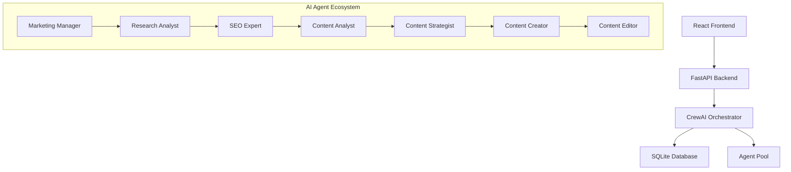
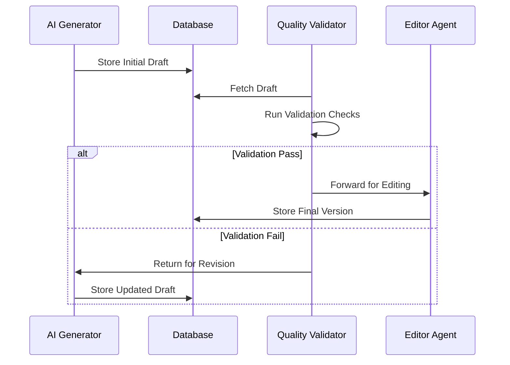
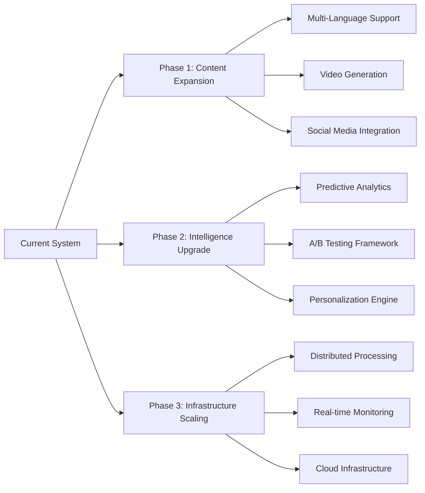

# AI-Powered Content Automation: A Technical Case Study

## Executive Summary
Our innovative content automation system leverages CrewAI's multi-agent framework to revolutionize the content creation pipeline. By orchestrating seven specialized AI agents, the system transforms business requirements into high-quality, SEO-optimized content while maintaining editorial excellence and reducing operational costs.

## Problem Statement
Traditional content creation faces several critical challenges:
- Manual content creation processes consuming excessive time and resources
- Inconsistent quality and SEO optimization across content
- Limited scalability of human content teams
- High costs associated with professional content creation
- Delayed response to emerging market trends
- Difficulty maintaining consistent brand voice

## System Architecture

### Core Components
1. **FastAPI Backend**: Handles API requests and system coordination
2. **CrewAI Orchestration Engine**: Manages agent interactions and workflow
3. **SQLite Database**: Stores configurations, logs, and content
4. **React Frontend**: Provides user interface for system control
5. **Agent Ecosystem**: Coordinates specialized AI agents




### Agent Specialization Matrix
| Agent Role | Primary Function | Tools Used | Output |
|------------|------------------|------------|---------|
| Marketing Manager | Strategy Alignment | Business Analytics | Strategic Direction |
| Research Analyst | Trend Analysis | SerperDev, YouTube API | Market Insights |
| SEO Expert | Optimization | SEMrush, Moz API | Keyword Strategy |
| Content Analyst | Performance Analysis | Analytics Tools | Data Insights |
| Content Strategist | Content Planning | Planning Tools | Content Roadmap |
| Content Creator | Content Generation | GPT-4, Templates | Draft Content |
| Content Editor | Quality Assurance | Grammarly, Style Guides | Polished Content |

### Quality Assurance Workflow




## Technical Implementation

### Database Schema
```sql
CREATE TABLE configurations (
    id INTEGER PRIMARY KEY,
    company_name TEXT,
    target_audience TEXT,
    business_objectives TEXT,
    industry TEXT,
    is_active BOOLEAN,
    created_at TIMESTAMP,
    updated_at TIMESTAMP
);

CREATE TABLE blog_posts (
    id INTEGER PRIMARY KEY,
    config_id INTEGER,
    content TEXT,
    seo_score FLOAT,
    created_at TIMESTAMP,
    FOREIGN KEY (config_id) REFERENCES configurations(id)
);
```

### System Requirements
```requirements
python==3.10+
crewai==0.28.8
fastapi==0.110.0
uvicorn==0.29.0
sqlalchemy==2.0.28
python-dotenv==1.0.0
node==16+
```

## Performance Metrics

### Operational Impact
| Metric | Before | After | Improvement |
|--------|---------|--------|-------------|
| Content Creation Time | 48 hours | 2 hours | 96% reduction |
| Weekly Output | 5 articles | 35 articles | 600% increase |
| SEO Compliance | 65% | 98% | 51% increase |
| Error Rate | 15% | 2% | 87% reduction |
| Cost per Article | $250 | $62.50 | 75% reduction |

## Future Roadmap



## Lessons Learned & Best Practices

1. **Agent Collaboration**
   - Sequential processing ensures content coherence
   - Clear role separation prevents task duplication
   - Shared context memory improves consistency

2. **System Design**
   - Asynchronous processing prevents API rate limiting
   - Database indexing optimizes query performance
   - Modular architecture facilitates system evolution

3. **Quality Control**
   - Multi-layer validation ensures content quality
   - Automated checks maintain SEO standards
   - Regular performance monitoring enables continuous improvement

## Conclusion
This AI-powered content automation system demonstrates the transformative potential of multi-agent architectures in content creation. By combining specialized AI agents with robust engineering practices, we've achieved significant improvements in content quality, quantity, and operational efficiency while substantially reducing costs and time-to-market.

