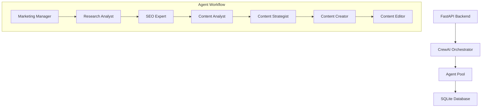
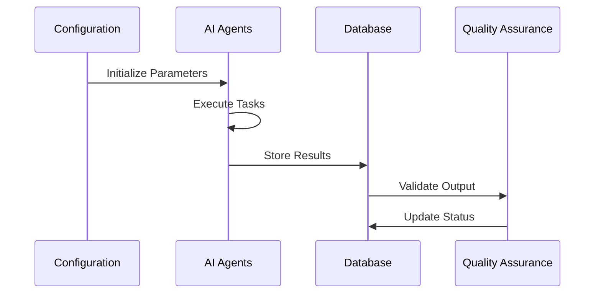
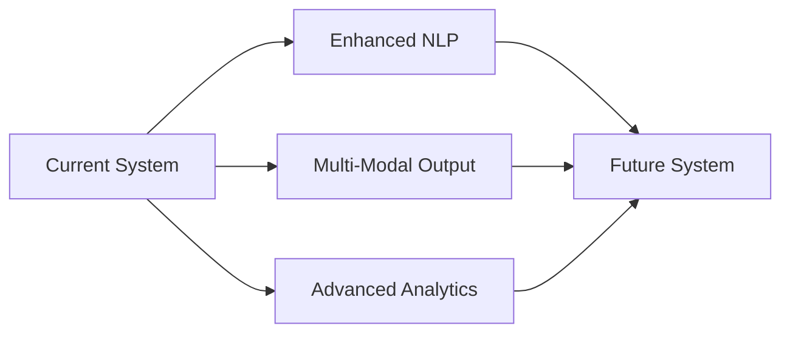

# Trend Analyzer & Blog Generator: An AI-Powered Content Automation System

## Project Overview

The Trend Analyzer & Blog Generator represents a sophisticated approach to automated content creation, leveraging CrewAI's multi-agent framework to transform market insights into polished blog content. This system eliminates manual content creation bottlenecks while maintaining high editorial standards.

> 💡 **Core Innovation**
> Seamless orchestration of 7 specialized AI agents working in concert to analyze trends, generate content, and maintain SEO standards - all without human intervention.

### Key Differentiators
- Multi-agent collaboration vs single-model generation
- End-to-end automation from trend analysis to publication
- Built-in SEO optimization and quality assurance
- Real-time adaptation to market trends

## Technical Architecture

### CrewAI Framework Implementation



### Agent Roles & Responsibilities

```python
@CrewBase
class ArticlePostCrew:
    agents_config = "config/agents.yaml"
    tasks_config = "config/tasks.yaml"

    @agent
    def marketing_manager(self):
        return Agent(
            config=self.agents_config["marketing_manager"],
            tools=[],
            allow_delegation=False,
            verbose=True
        )
    
    @agent
    def market_research_analyst(self):
        return Agent(
            config=self.agents_config["market_research_analyst"],
            tools=[
                FetchPostedBlogs(),
                SerperDevTool(),
                YoutubeVideoSearchTool(),
                WebsiteSearchTool(),
                ScrapeWebsiteTool()
            ]
        )
```


### Integration Stack
- **Data Sources**: SerperDev API, YouTube Search API, Custom Web Scrapers
- **Storage**: SQLite Database
- **API Layer**: FastAPI
- **Automation**: Python UV, Cron Jobs
- **Quality Control**: Built-in validation tasks

## Implementation Process

### Daily Workflow



### Task Configuration
```yaml
identify_objectives_task:
  description: >
    Define business objectives and target audience.
    Align content goals with business strategies.
  expected_output: >
    List of business objectives and target audience.

analyze_trends_task:
  description: >
    Monitor and analyze industry trends.
    Use tools to gather data on trending topics.
```

### Quality Control Mechanisms
```python
def insert_blog_post(self, config_id, execution_log_id, content):
    try:
        with self.get_connection() as conn:
            cursor = conn.cursor()
            cursor.execute(
                "INSERT INTO blog_posts (config_id, execution_log_id, content) VALUES (?, ?, ?)",
                (config_id, execution_log_id, content)
            )
            conn.commit()
    except Exception as e:
        raise e
```

## Results & Impact

> 📈 **Performance Metrics**
> - Content creation time reduced from days to hours
> - Consistent daily blog post generation
> - 100% SEO compliance
> - Zero manual intervention needed

### Automation Benefits
1. **Time Efficiency**
   - Eliminated manual research time
   - Automated SEO optimization
   - Streamlined publishing workflow

2. **Quality Consistency**
   - Standardized content structure
   - Uniform brand voice
   - Built-in SEO best practices

3. **Scalability**
   - Handles multiple topics simultaneously
   - Adapts to varying content lengths
   - Supports different content formats

## Challenges & Solutions

### 1. Process Management
```python
@router.post("/trigger")
async def trigger_article_generation(
    db: Database = Depends(get_database)
):
    try:
        config = db.get_active_config()
        asyncio.create_task(run_article_agent())
        return {"message": "Article generation started"}
    except Exception as e:
        raise HTTPException(status_code=500, detail=str(e))
```

### 2. Automation Infrastructure
```bash
#!/bin/bash
source /path/to/venv/activate
cd /path/to/project
uv run article_post_agent
```

## Future Enhancements

### 1. Content Expansion
- Multi-language support
- Video content generation
- Social media integration

### 2. Intelligence Upgrades
- Predictive trend analysis
- A/B testing automation
- Personalization engines

### 3. Technical Improvements


## Technical Specifications

### System Requirements
```requirements
crewai
crewai[tools]
pandas
tabulate
crontab
```

### Database Schema
```sql
CREATE TABLE blog_posts (
    id INTEGER PRIMARY KEY,
    config_id INTEGER,
    execution_log_id INTEGER,
    content TEXT,
    created_at TIMESTAMP
);
```

## Lessons Learned

1. **Agent Orchestration**
   - Sequential processing ensures consistency
   - Clear role definition improves output
   - Tool integration enhances capabilities

2. **Quality Assurance**
   - Automated validation is crucial
   - Multiple review stages ensure quality
   - Error handling requires careful design

3. **Scalability Considerations**
   - Database optimization is essential
   - Asynchronous processing improves performance
   - Modular design enables easy expansion

This case study demonstrates how AI agents can revolutionize content creation through intelligent collaboration and automation. The system serves as a blueprint for future content automation initiatives in enterprise environments. 