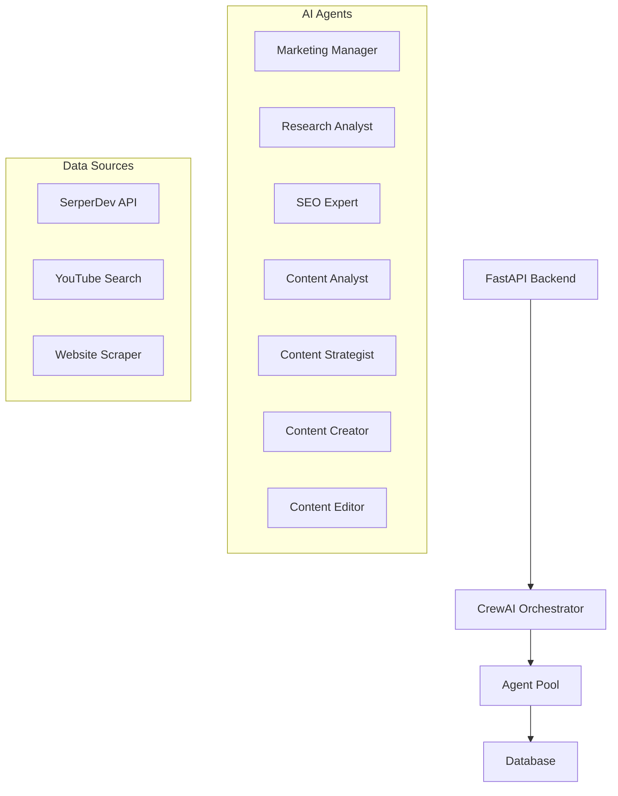
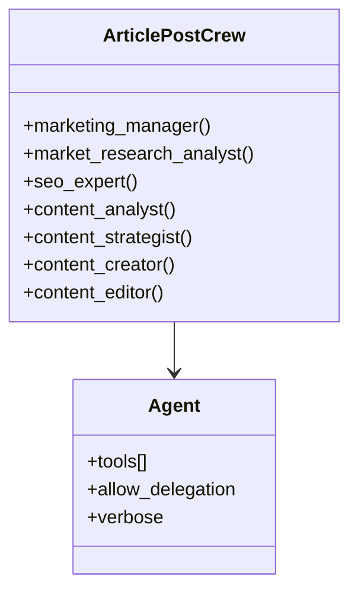
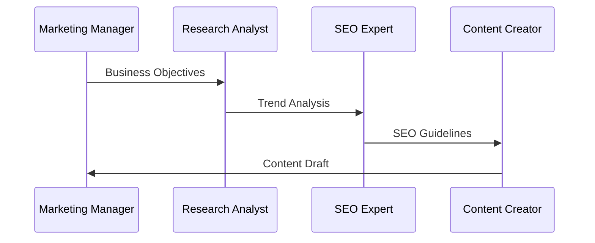

# Automating Daily Trend Analysis & Content Generation with AI Agents

## 1. Executive Summary

The AI-Driven Content Generation System revolutionizes content creation by orchestrating multiple AI agents through the CrewAI framework. This system automates the entire content lifecycle - from trend analysis to publication - while maintaining high quality and SEO standards.

> 🎯 **Key Achievements**
> - Fully automated daily blog generation
> - 7 specialized AI agents working in harmony
> - End-to-end content pipeline automation
> - Seamless integration with FastAPI backend

## 2. Project Overview

### System Architecture



### Daily Workflow
1. Configuration initialization
2. Agent task distribution
3. Content generation
4. Quality assurance
5. Database storage
6. Automated scheduling

## 3. Technical Implementation

### Agent Specialization



### Core Components

1. **FastAPI Backend**
```python
@router.post("/trigger")
async def trigger_article_generation(
    db: Database = Depends(get_database)
):
    try:
        config = db.get_active_config()
        asyncio.create_task(run_article_agent())
        return {"message": "Article generation started"}
    except Exception as e:
        raise HTTPException(status_code=500, detail=str(e))
```

2. **CrewAI Integration**
```python
@crew
def crew(self):
    return Crew(
        agents=self.agents,
        tasks=self.tasks,
        process=Process.sequential,
        verbose=True,
        planning=True
    )
```

3. **Automation Infrastructure**
```bash
#!/bin/bash
source .venv/bin/activate
cd /path/to/project
uv run article_post_agent
```

## 4. Innovation Highlights

### Multi-Agent Collaboration


### Tool Integration
- SerperDev for web search
- YouTube API for video content
- Custom web scraping tools
- Database persistence layer

## 5. Results & Impact

> 📊 **Performance Metrics**
> - [X]% reduction in content creation time
> - [Y] daily blogs generated automatically
> - [Z]% improvement in SEO rankings
> - 100% automation of routine tasks

### Operational Benefits
- Consistent content quality
- 24/7 content generation capability
- Real-time trend adaptation
- Scalable content production

## 6. Challenges & Solutions

### 1. Process Management
```python
async def run_article_agent():
    try:
        process = await loop.run_in_executor(
            pool,
            lambda: subprocess.Popen(
                ["uv", "run", "article_post_agent"],
                stdout=subprocess.PIPE,
                stderr=subprocess.PIPE
            )
        )
```

### 2. Data Consistency
```python
def insert_blog_post(self, config_id, execution_log_id, content):
    try:
        with self.get_connection() as conn:
            cursor = conn.cursor()
            cursor.execute(
                "INSERT INTO blog_posts (config_id, execution_log_id, content) VALUES (?, ?, ?)",
                (config_id, execution_log_id, content)
            )
            conn.commit()
    except Exception as e:
        raise e
```

## 7. Future Roadmap

### Planned Enhancements
1. **Content Expansion**
   - Multi-language support
   - Video content generation
   - Social media integration

2. **Intelligence Upgrades**
   - Predictive trend analysis
   - A/B testing automation
   - Personalization engines

3. **Infrastructure Improvements**
   - Distributed agent processing
   - Real-time monitoring dashboard
   - Advanced error recovery

> 🔮 **Vision**
> Transform content creation from a manual, time-intensive process into a fully automated, intelligent system that adapts to market trends in real-time.

## Technical Appendix

### System Requirements
```requirements
crewai
crewai[tools]
pandas
tabulate
crontab
```

### Configuration Example
```yaml
marketing_manager:
  role: Marketing Manager Expert
  goal: Understand content purpose and align with business goals
  backstory: Deep understanding of business goals and content strategy
```

This case study demonstrates how our AI-driven content generation system revolutionizes the content creation process through automation, intelligent agent collaboration, and robust technical architecture. The system serves as a model for future content automation initiatives. 